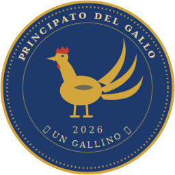

# 🐓 Gallino (GAL)

**The currency of the Principato del Gallo** — a community token on Polygon PoS with a monetary constitution carved into its code.

  

## What is the Gallino

The Gallino is the identity currency of the [Principato del Gallo](https://www.instagram.com/principatodelgallo), a micronation founded in Bernareggio, Italy, in 2026. It is an ERC-20 token, freely transferable and tradable through a public liquidity pool — created to prove that a community, however small, can give itself transparent money.

**It is not an investment.** Nobody promises, guarantees or implies any value, return or buyback. See the full [legal notice](https://principato-del-gallo.github.io/Gallino/) on the official site.

## Monetary Charter (enforced by the contract)

| Rule | Value |
|---|---|
| Initial issue | 1,000,000,000 GAL — minted once |
| Future minting | max **+10% of supply per monetary year** — a hard limit in the contract, no authority can exceed it |
| Minting transparency | every mint requires a public motivation, recorded on-chain forever (`Conio` event) |
| Deflation | any holder can `burn` their own GAL |
| Declared allocation | 10% exchange pool · 60% Distribution Fund for citizens · 30% Treasury Reserve |

## Official references

| | |
|---|---|
| 🌐 Official site | https://principato-del-gallo.github.io/Gallino/ |
| 📜 Contract (verified) | [`0x0c612496AeD62e77B1F8B0cc9bC64E7d466ab709`](https://polygonscan.com/address/0x0c612496AeD62e77B1F8B0cc9bC64E7d466ab709) |
| 🔁 Buy / sell (QuickSwap) | [Swap USDC ↔ GAL](https://dapp.quickswap.exchange/swap?type=best&from=0x3c499c542cEF5E3811e1192ce70d8cC03d5c3359&to=0x0c612496AeD62e77B1F8B0cc9bC64E7d466ab709) |
| 📈 Live chart (DEXScreener) | https://dexscreener.com/polygon/0x3b06b50b08ad149f15c888bdcde3a5a97a01c58c |
| 🪙 Token list | [`gallino.tokenlist.json`](gallino.tokenlist.json) — import the raw URL in QuickSwap to see GAL with its logo |
| ✍️ Genesis Proclamation | [`PROCLAMATION.md`](PROCLAMATION.md) — cryptographically signed by the Treasury |

⚠️ **The only official GAL is at the contract address above.** Always verify it before interacting with any token named "Gallino".

## Repository contents

- `index.html` — official site (GitHub Pages)
- `Gallino.sol` — the token contract source (also verified on Polygonscan)
- `logo-gallino.svg`, `gallino-icon-256.png`, `gallino-icon-32.svg` — official coin artwork
- `stemma-gallo.png` — coat of arms of the Principato
- `gallino.tokenlist.json` — official token list
- `PROCLAMATION.md` — signed Genesis Proclamation
- `gallino-qr.png` — QR code to the official site

## License

Contract code under MIT. Artwork and texts © Principato del Gallo — all rights reserved.

---

*"The Gallino promises no riches: it only promises to exist, verifiably, on a public blockchain."* — The Treasury
